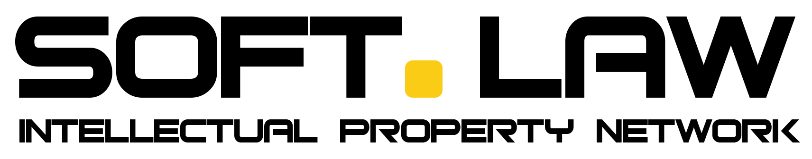

# Softlaw DAO

<div align="center">
  
  
  **A Decentralized Autonomous Legal Organization Protocol**
  
  [](https://opensource.org/licenses/MIT)
  [](https://soliditylang.org/)
  [](https://polkadot.network/)
</div>

## 📜 Project Description

Softlaw DAO is a decentralized protocol that brings copyright licensing and member coordination—lawyers, artists, musicians, investors, and creatives—on-chain. It enables transparent and autonomous management of treasury requests, membership applications, governance proposals, and the minting of copyright licenses.

## 🔑 Key Features

- **Digital Legal Licensing**: Create, validate, and manage legal licenses on-chain with full transparency and immutability
- **DAO Governance**: Community-driven decision-making for protocol updates, membership approvals, and license management
- **Modular Treasury**: Flexible financial operations to ensure the sustainability of the protocol ecosystem
- **ERC-20 Utility Token**: Native token providing protocol utility

## 📦 Smart Contract Architecture

The protocol consists of the following core smart contracts:

| Contract               | Description                                                                                                                 | Link                                                                                     |
| ---------------------- | --------------------------------------------------------------------------------------------------------------------------- | ---------------------------------------------------------------------------------------- |
| **Governor.sol**       | Core DAO contract managing licensing, administrative and treasury proposals, including internal function calls and encoding | [View Code](https://github.com/wariomx/encodeHackathon2025/blob/main/Governor.sol)       |
| **LicenseManager.sol** | Intermediary between governor proposals and executions in the license contract                                              | [View Code](https://github.com/wariomx/encodeHackathon2025/blob/main/LicenseManager.sol) |
| **License.sol**        | Handles creation, validation, and revocation of legal licenses across the protocol                                          | [View Code](https://github.com/wariomx/encodeHackathon2025/blob/main/License.sol)        |
| **Treasury.sol**       | Manages the DAO's financial operations, token allocations, and transfers                                                    | [View Code](https://github.com/wariomx/encodeHackathon2025/blob/main/Treasury.sol)       |
| **Token.sol**          | ERC-20 compliant token providing governance rights and protocol utility                                                     | [View Code](https://github.com/wariomx/encodeHackathon2025/blob/main/Token.sol)          |
|                        |

## ⚙️ Development Guide

### Prerequisites

- Node.js
- pnpm
- solidity
- Typescript

### AI Tools

- Claude
- Cursor

### Local Setup

```bash
# Clone the repository
git clone https://github.com/wariomx/encodeHackathon2025/
cd encodeHackathon2025

# Install dependencies
pnpm install
```

### Citation and documentation followed.

Open Zeppellin: [View Docs](https://docs.openzeppelin.com/contracts/5.x/)
Solidity: [View Docs](https://docs.soliditylang.org/en/v0.8.28/)
Contracts Polkadot: [View Docs](https://contracts.polkadot.io/build-your-first-dapp)

### Development Workflow

1. Edit smart contracts in the root directory
2. Compile smart contracts:
   ```bash
   pnpm build
   ```
3. Deploy contracts:
   ```bash
   pnpm deploy-contracts
   ```

### Environment Variables

Create a `.env` file with the following variables:

```
ACCOUNT_SEED=your_seed_phrase_here
RPC_URL=https://westend-asset-hub-eth-rpc.polkadot.io
```

- `ACCOUNT_SEED`: Seed phrase for the account that will sign the deployment
- `RPC_URL`: RPC endpoint
  - For Westend Asset Hub: `https://westend-asset-hub-eth-rpc.polkadot.io`

## 🔗 Related Projects

This repository is part of a Web3 Foundation grant that is currently in progress. The DAO components developed during the hackathon will be integrated into the broader grant project.

For more information about the W3F grant project, visit: [https://github.com/soft-law/W3F_Grant](https://github.com/soft-law/W3F_Grant)

## 👤 Team

**Wario**  
LegalTech Wizard

## 📄 License

This project is licensed under the MIT License - see the [LICENSE](LICENSE) file for details.

---

<div align="center">
  <sub>Built with ❤️ for the Polkadot Community</sub>
</div>
